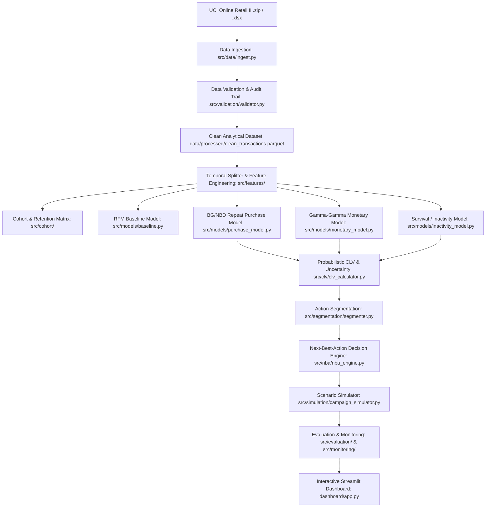

# Probabilistic Customer Lifetime Value with Cohort Dynamics and Next-Best-Action Segments

**Course / Programme**: T.Y. B.Sc. Data Science – Semester V  
**Project Code**: BDS-34  
**Team**: 2 Students  
**Status**: Capstone Production-Grade Implementation  

---

## 1. Executive Summary & Problem Statement

Customer Lifetime Value (CLV) is a cornerstone metric for retail organizations, dictating customer acquisition costs, retention investments, and resource allocation. However, traditional heuristic approaches (such as historical average spend or simple RFM scoring) suffer from critical flaws:
1. **Survivorship & Recency Bias**: They assume past high spenders will continue indefinitely, ignoring dropout/churn risk.
2. **Deterministic False Precision**: Point-estimate CLV fails to communicate uncertainty or statistical variance.
3. **Actionability Gap**: Knowing a customer's CLV does not inform *what marketing action* or *channel* to trigger.

This capstone project implements an end-to-end, industry-standard, reproducible customer intelligence platform. Built on the official **UCI Online Retail II** dataset, the system combines:
- **Temporal Leakage-Free Data Pipeline**: Robust schema validation, audit trail, and time-based train/holdout splits.
- **Cohort Dynamics & Retention Analysis**: Acquisition month cohort matrices, repeat purchase rates, and revenue curves.
- **Probabilistic Modeling**:
  - **BG/NBD (Beta-Geometric / Negative Binomial Distribution)**: Probabilistic repeat transaction counts and $P(\text{Alive})$.
  - **Gamma-Gamma Model**: Probabilistic expected average monetary basket spend.
  - **Survival Analysis (Kaplan-Meier & Weibull Hazard)**: Customer inactivity probabilities over 30, 60, and 90-day horizons.
- **CLV Uncertainty Quantification**: 80% bootstrap confidence intervals ($[CLV_{lower}, CLV_{upper}]$) across multiple horizons (30, 90, 180, 365 days).
- **Action-Oriented Segmentation & Next-Best-Action (NBA) Engine**: Translating probabilistic distributions into high-leverage business actions (`RETENTION`, `WIN_BACK`, `UPSELL`, `CROSS_SELL`, `LOYALTY_REWARD`, `NO_ACTION`) with prioritized channels and estimated touch costs.
- **Interactive Campaign Scenario Simulator**: What-if ROI modeling under parameterized budget, discount, and uplift assumptions.
- **Interactive Multi-Page Streamlit Dashboard**: Production-grade visual command center for executive oversight, customer drill-down, and model monitoring.

---

## 2. System Architecture



---

## 3. Dataset Information & Provenance

- **Official Source**: [UCI Machine Learning Repository - Online Retail II](https://archive.ics.uci.edu/dataset/502/online%2Bretail%2Bii)
- **Direct Source URL**: `https://archive.ics.uci.edu/static/public/502/online+retail+ii.zip`
- **Scope**: Transactions spanning December 1, 2009 to December 9, 2011 for a UK-based registered giftware retailer.
- **Size**: ~1,067,371 rows across two annual sheets (`Year 2009-2010` and `Year 2010-2011`).
- **Core Columns**: `Invoice`, `StockCode`, `Description`, `Quantity`, `InvoiceDate`, `Price`, `Customer ID`, `Country`.

---

## 4. Quick Start & Reproducibility Guide

### Prerequisites
- Python 3.10+ (tested on Python 3.11)
- Git

### Installation
1. Clone or navigate to the repository:
   ```bash
   cd customer-clv-capstone
   ```
2. Create and activate a virtual environment (optional but recommended):
   ```bash
   python -m venv venv
   # Windows:
   venv\Scripts\activate
   # Linux/macOS:
   source venv/bin/activate
   ```
3. Install dependencies:
   ```bash
   pip install -r requirements.txt
   ```

### Execution Pipeline

1. **Ingest and Validate Raw Data**:
   ```bash
   python -m src.data.ingest
   python -m src.validation.validator
   ```
   *Note: If internet access is constrained, place the official `online_retail_II.xlsx` into `data/raw/` and run the command.*

2. **Execute Full End-to-End Pipeline**:
   ```bash
   python -m src.pipeline
   ```
   This generates the cleaned transaction dataset, customer behavioral features, cohort retention matrices, probabilistic models, CLV estimates with uncertainty bounds, action segments, and NBA recommendations.

3. **Run Automated Test Suite**:
   ```bash
   pytest tests/
   ```

4. **Launch Interactive Streamlit Dashboard**:
   ```bash
   streamlit run dashboard/app.py
   ```

---

## 5. Repository Structure

```
customer-clv-capstone/
├── configs/
│   └── default_config.yaml          # Centralized configuration (thresholds, paths, parameters)
├── data/
│   ├── raw/                         # Raw data (gitignored)
│   ├── processed/                   # Clean analytical & feature datasets
│   ├── synthetic/                   # Isolated synthetic campaign datasets
│   └── validation/                  # Schema validation audit records
├── docs/
│   ├── architecture/                # Architecture diagrams and specifications
│   ├── data_dictionary.md           # Field-by-field schema documentation
│   ├── contribution_log.md          # Student activity and peer review log
│   ├── threat_model.md              # Security, privacy, and leakage threat model
│   └── model_card.md                # ML model governance & ethical limitations
├── src/
│   ├── config/                      # Pydantic configuration loaders
│   ├── data/                        # Ingestion and raw file extraction
│   ├── validation/                  # Data quality, anomaly detection, and schema validation
│   ├── features/                    # Feature store, temporal splits, and aggregations
│   ├── cohort/                      # Monthly cohort retention and revenue dynamics
│   ├── models/                      # BG/NBD, Gamma-Gamma, Survival, and Baseline models
│   ├── clv/                         # Probabilistic CLV & bootstrap uncertainty bounds
│   ├── segmentation/                # Value-Risk matrix and action-oriented clustering
│   ├── nba/                         # Next-Best-Action rules and priority scoring
│   ├── simulation/                  # Campaign scenario simulator and ROI modeling
│   ├── evaluation/                  # Temporal holdout benchmarking, calibration, stability
│   ├── monitoring/                  # Data drift, PSI, and feature distribution monitoring
│   └── pipeline.py                  # End-to-end pipeline orchestrator
├── dashboard/
│   ├── app.py                       # Main Streamlit dashboard entrypoint
│   └── pages/                       # Multi-page modular UI views
├── tests/
│   ├── unit/                        # Unit tests for individual components
│   └── integration/                 # End-to-end integration tests
├── Dockerfile                       # Container deployment definition
├── docker-compose.yml               # Container orchestration
├── requirements.txt                 # Exact Python dependency pinning
└── README.md                        # Primary project documentation
```

---

## 6. Key Deliverables & Methodological Highlights

- **Temporal Strictness**: Zero future leakage. Cutoff dates cleanly split observation windows from holdout ground truth.
- **Statistical Rigor**: Verification of Gamma-Gamma independence assumptions prior to model fitting.
- **Uncertainty Quantification**: 80% bootstrap prediction intervals provide marketers with empirical risk bounds rather than misleading point precision.
- **Prescriptive Analytics**: Actionable transition from descriptive analytics ($CLV = £850$) to prescriptive intervention (*"High Value At Risk; Trigger Win-Back SMS with £15 discount voucher; Expected ROI = 280%"*).
- **Synthetic Campaign Isolation**: Strictly labeled simulation layer ensuring academic integrity.
