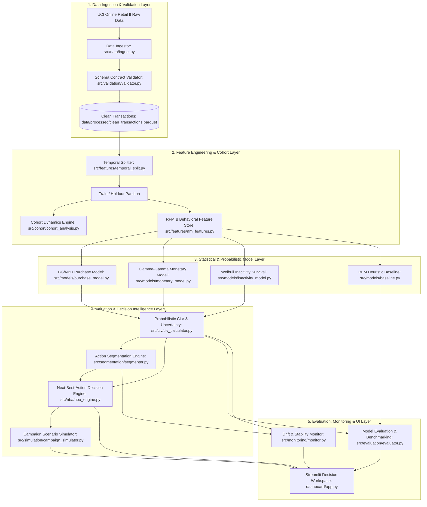

# System Architecture Document

**Project Name**: Probabilistic Customer Lifetime Value with Cohort Dynamics and Next-Best-Action Segments  
**Project Code**: BDS-34  
**Course / Programme**: T.Y. B.Sc. Data Science – Semester V  
**Project Creators / Team**:
- **Sachin Swarnkar** (Roll No. `TDDS028B`)
- **Shivam Yadav** (Roll No. `TDDS044B`)  
**Status**: Capstone Architecture Specification  
**Version**: 1.0.0  

---

## 1. High-Level System Architecture

The platform follows a modular, layer-oriented architecture designed to ensure zero data leakage across temporal boundaries, strict schema validation, robust statistical modeling, and seamless downstream business consumption.



---

## 2. Subsystem & Module Specifications

### 2.1 Ingestion & Validation Subsystem (`src/data/`, `src/validation/`)
- **Ingestion (`src/data/ingest.py`)**: Fetches or reads the raw UCI Online Retail II dataset, handling multiple sheets (`Year 2009-2010` and `Year 2010-2011`).
- **Validation (`src/validation/validator.py`)**: Enforces schema contracts (`schema_contract.json`), checks data integrity, filters invalid customer records, handles cancellation orders (invoice prefix `C`), and logs an immutable audit trail.
- **Output**: Clean analytical transactions saved in Apache Parquet format (`data/processed/clean_transactions.parquet`).

### 2.2 Feature & Cohort Engineering Subsystem (`src/features/`, `src/cohort/`)
- **Temporal Splitter (`src/features/temporal_split.py`)**: Strictly partitions transactions at temporal cutoff $T_{split}$ (e.g., 2010-12-09) to guarantee zero future lookahead bias.
- **Behavioral Feature Store (`src/features/rfm_features.py`)**: Generates customer-level frequency ($x$), recency ($t_x$), observation period length ($T$), and average monetary value ($\bar{M}$).
- **Cohort Analyzer (`src/cohort/cohort_analysis.py`)**: Computes customer acquisition month cohort matrices, period-over-period retention percentages, and cumulative revenue trajectories.

### 2.3 Probabilistic & Survival Modeling Subsystem (`src/models/`)
- **BG/NBD Repeat Purchase Model (`src/models/purchase_model.py`)**:
  - Fits parameters $r, \alpha, a, b$ via maximum likelihood.
  - Computes customer active status probability $P(\text{Alive})$ and expected future purchase counts $E[Y(t)]$.
- **Gamma-Gamma Monetary Model (`src/models/monetary_model.py`)**:
  - Tests Pearson correlation between frequency and monetary value.
  - Fits parameters $p, q, v$ to estimate expected monetary value per transaction $E[M]$.
- **Time-to-Inactivity Survival Model (`src/models/inactivity_model.py`)**:
  - Correctly defines right-censored event times without lookahead.
  - Generates Kaplan-Meier survival curves and parametric Weibull hazard estimates for 30, 60, and 90-day inactivity risks.
- **Baseline Model (`src/models/baseline.py`)**: Implements traditional quintile-based RFM scoring and annualized historical spend extrapolations for rigorous comparative evaluation.

### 2.4 CLV Calculation & Uncertainty Subsystem (`src/clv/`)
- **Calculator (`src/clv/clv_calculator.py`)**:
  - Combines BG/NBD transaction expectations, Gamma-Gamma monetary spend, and continuous discount factors:
    $$CLV = \sum_{t=1}^H \frac{E[Y(t)] \cdot E[M]}{(1 + d/365)^t}$$
  - Executes Monte Carlo simulations (draws $= 1,000$) to yield 80% predictive intervals $[CLV_{lower}, CLV_{upper}]$ and standard error metrics.

### 2.5 Action Segmentation & Next-Best-Action (NBA) Engine (`src/segmentation/`, `src/nba/`)
- **Segmenter (`src/segmentation/segmenter.py`)**: Maps joint distributions of $CLV$, $P(\text{Alive})$, and inactivity risk into 6 strategic tiers:
  - `CHAMPION_HIGH_VALUE`, `LOYAL_CORE`, `POTENTIAL_LOYALIST`, `AT_RISK_HIGH_VALUE`, `HIBERNATING`, `LOST_CUSTOMER`.
- **Decision Engine (`src/nba/nba_engine.py`)**: Deterministically allocates recommended actions (`RETENTION`, `WIN_BACK`, `UPSELL`, `CROSS_SELL`, `LOYALTY_REWARD`, `NO_ACTION`), prioritizes outreach channels (`EMAIL`, `SMS`, `DIRECT_MAIL`, `ACCOUNT_CALL`), and estimates touch costs and expected incremental return.

### 2.6 Campaign Simulation & Evaluation Subsystem (`src/simulation/`, `src/evaluation/`, `src/monitoring/`)
- **Scenario Simulator (`src/simulation/campaign_simulator.py`)**: Interactive what-if planning tool simulating campaign budget, response rate, discount costs, incremental revenue, and breakeven thresholds.
- **Holdout Evaluator (`src/evaluation/evaluator.py`)**: Measures holdout revenue predictions (MAE, RMSE, Spearman rank correlation), interval coverage percentage, and segment transition matrices.
- **Drift Monitor (`src/monitoring/monitor.py`)**: Calculates Population Stability Index (PSI) and Wasserstein distance for key feature and model score distributions.

### 2.7 Interactive Web Application (`dashboard/app.py`)
- Multi-page Streamlit application comprising:
  1. Executive Summary & KPIs
  2. Cohort Retention Heatmaps & Revenue Trajectories
  3. Single-Customer Scoring Studio ("Customer Action Studio")
  4. What-If Campaign Scenario Simulator
  5. Model Benchmarking & Governance Monitoring.

---

## 3. Technology Stack

| Layer | Technologies / Frameworks |
|---|---|
| **Core Runtime** | Python 3.11 |
| **Data Processing** | Pandas, NumPy, PyArrow (Parquet) |
| **Statistical Modeling** | Lifetimes, Lifelines, SciPy, Scikit-Learn |
| **Visualization & UI** | Streamlit, Plotly, Seaborn, Matplotlib |
| **Quality & CI/CD** | Pytest, Flake8, Bandit, Pip-Audit, GitHub Actions |
| **Containerization** | Docker, Docker Compose |

---

## 4. Deployment & Execution Architecture

```
customer-clv-capstone/
├── Dockerfile                  # Multi-stage production container build
├── docker-compose.yml          # Container service orchestration
├── scripts/
│   ├── docker_entrypoint.sh    # Entrypoint script with startup validation
│   ├── run_pipeline.py         # Headless full pipeline executor
│   ├── run_dashboard.py        # Streamlit web application launcher
│   └── score_customer.py       # CLI single-customer inference tool
```
