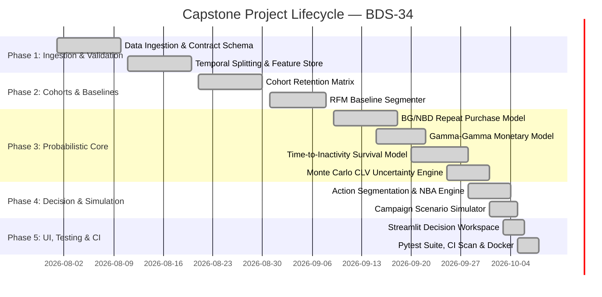

# Work Breakdown Structure & Task Tracking (TASKS.md)

**Project Name**: Probabilistic Customer Lifetime Value with Cohort Dynamics and Next-Best-Action Segments  
**Project Code**: BDS-34  
**Course / Programme**: T.Y. B.Sc. Data Science – Semester V  
**Project Creators / Team**:
- **Sachin Swarnkar** (Roll No. `TDDS028B`)
- **Shivam Yadav** (Roll No. `TDDS044B`)  
**Status**: Execution Log & Task Tracking  
**Version**: 1.0.0  

---

## 1. Project Milestones & Phases

---

## 2. Detailed Task Breakdown & Ownership

| Task ID | Component / Description | Primary Owner | Status | Artifact / Deliverable |
|---|---|---|---|---|
| **TSK-01** | Data ingestion pipeline from UCI repository | Sachin Swarnkar | Done | `src/data/ingest.py` |
| **TSK-02** | Schema validation & immutable audit trail | Shivam Yadav | Done | `src/validation/validator.py` |
| **TSK-03** | Temporal leakage-free train/holdout partition | Sachin Swarnkar | Done | `src/features/temporal_split.py` |
| **TSK-04** | RFM behavioral feature store computation | Shivam Yadav | Done | `src/features/rfm_features.py` |
| **TSK-05** | Monthly cohort retention matrices & revenue curves | Sachin Swarnkar | Done | `src/cohort/cohort_analysis.py` |
| **TSK-06** | RFM baseline heuristic benchmarking | Shivam Yadav | Done | `src/models/baseline.py` |
| **TSK-07** | BG/NBD repeat transaction model implementation | Sachin Swarnkar | Done | `src/models/purchase_model.py` |
| **TSK-08** | Gamma-Gamma monetary basket model implementation | Shivam Yadav | Done | `src/models/monetary_model.py` |
| **TSK-09** | Time-to-inactivity Kaplan-Meier & Weibull survival models | Sachin Swarnkar | Done | `src/models/inactivity_model.py` |
| **TSK-10** | Discounted CLV engine with Monte Carlo predictive intervals | Shivam Yadav | Done | `src/clv/clv_calculator.py` |
| **TSK-11** | Action-oriented customer segmentation | Sachin Swarnkar | Done | `src/segmentation/segmenter.py` |
| **TSK-12** | Next-Best-Action (NBA) rule & channel allocation engine | Shivam Yadav | Done | `src/nba/nba_engine.py` |
| **TSK-13** | What-if Campaign Scenario Simulator & ROI planner | Sachin Swarnkar | Done | `src/simulation/campaign_simulator.py` |
| **TSK-14** | Holdout model evaluator & calibration analysis | Shivam Yadav | Done | `src/evaluation/evaluator.py` |
| **TSK-15** | Feature drift & PSI stability monitoring | Sachin Swarnkar | Done | `src/monitoring/monitor.py` |
| **TSK-16** | Multi-page Streamlit interactive dashboard | Sachin Swarnkar & Shivam Yadav | Done | `dashboard/app.py` |
| **TSK-17** | Unit & regression testing suite | Shivam Yadav | Done | `tests/unit/` |
| **TSK-18** | Dockerfile, Compose & CI/CD workflow | Sachin Swarnkar | Done | `Dockerfile`, `.github/workflows/ci.yml` |
| **TSK-19** | Documentation suite (PRD, Architecture, Rules, Design, Tasks, Memory) | Sachin Swarnkar & Shivam Yadav | Done | `docs/` |

---

## 3. Verification Checklist

- [x] End-to-end pipeline executes without errors: `python -m src.pipeline`
- [x] Automated test suite passes 100%: `pytest tests/`
- [x] Streamlit dashboard launches and renders all pages: `python scripts/run_dashboard.py`
- [x] Single-customer scoring CLI works: `python scripts/score_customer.py --customer-id 12346`
- [x] Clean Git working tree and synchronized GitHub remote.
