# Architecture Design Document - BDS-34 Capstone Project

**Project**: Probabilistic Customer Lifetime Value with Cohort Dynamics and Next-Best-Action Segments  
**Course Code**: BDS-34 | T.Y. B.Sc. Data Science – Semester V  
**Team**: 2 Students  

---

## 1. System Overview and End-to-End Pipeline

The platform is designed as an enterprise-grade, reproducible customer intelligence framework that processes transactional retail data, prevents temporal leakage, models probabilistic customer longevity and basket values, and delivers prescriptive Next-Best-Action (NBA) strategies.

```mermaid
flowchart TD
    A[Official UCI Online Retail II Source] --> B[Data Ingestion Module]
    B --> C[Data Quality & Schema Validation Engine]
    C --> D[Audit Trail & Validation Reports]
    C --> E[Clean Analytical Transactions]
    E --> F[Temporal Train / Holdout Splitter]
    F --> G[Cohort & Retention Dynamics Analyzer]
    F --> H[Customer Behavioral Feature Store]
    H --> I[RFM Baseline Segmenter]
    H --> J[BG/NBD Probabilistic Repeat Purchase Model]
    H --> K[Gamma-Gamma Monetary Value Model]
    H --> L[Parametric Survival & Inactivity Estimator]
    J & K & L --> M[Probabilistic CLV & Uncertainty Engine]
    M & I --> N[Baseline vs Probabilistic Evaluator]
    M --> O[Action-Oriented Segmentation Engine]
    O & M --> P[Next-Best-Action Decision Engine]
    P --> Q[Synthetic Campaign Simulator & ROI Planner]
    Q --> R[Interactive Streamlit Command Dashboard]
    R --> S[Data Drift & Calibration Monitoring]
```



---

## 2. Core Modules Breakdown

### 2.1 Ingestion & Validation (`src/data/ingest.py`, `src/validation/validator.py`)
- **Ingestion**: Automates retrieval from the official UCI repository (`https://archive.ics.uci.edu/static/public/502/online+retail+ii.zip`) and extracts multi-year Excel sheets (`Year 2009-2010` and `Year 2010-2011`).
- **Validation**: Schema enforcement, type casting, non-silent filtering of missing customer IDs, cancelled invoices, returns, non-positive unit prices, and out-of-boundary dates. Emits detailed data quality JSON and Markdown reports.

### 2.2 Temporal Leakage Prevention (`src/features/splitter.py`)
- Standard cross-validation randomly splits records across time, causing future transactions to contaminate historical training features.
- Our architecture strictly partitions transactions into:
  1. **Training Observation Window**: e.g., 2009-12-01 to 2010-12-09 ($T_{train}$).
  2. **Holdout Evaluation Window**: e.g., 2010-12-10 to 2011-12-09 ($T_{holdout}$).
- Features, cohorts, and model fits are calculated strictly using data up to the cutoff date. Future records are strictly reserved as holdout ground truth.

### 2.3 Cohort Analysis (`src/cohort/cohort_analysis.py`)
- Identifies acquisition month ($C_i$) for every unique customer.
- Builds monthly active customer retention matrices, repeat purchase rates, revenue curves, and cohort lifetime value progression.

### 2.4 Baseline Modeling (`src/models/baseline.py`)
- **Baseline A (Historical Average / Heuristic)**: Customer's future value estimated from historical annualized spend: $\widehat{V}_i = \text{historical\_revenue}_i \times \frac{T_{pred}}{T_{observed}}$.
- **Baseline B (RFM Scoring)**: Quantile-based $R, F, M \in [1, 5]$ composite scores and heuristic rule segments.

### 2.5 Probabilistic Purchase & Monetary Modeling (`src/models/purchase_model.py`, `src/models/monetary_model.py`)
- **BG/NBD (Beta-Geometric / Negative Binomial Distribution)**:
  - While active, transaction counts follow Poisson distribution with transaction rate $\lambda \sim \text{Gamma}(r, \alpha)$.
  - Dropout occurs after any transaction with probability $p \sim \text{Beta}(a, b)$.
  - Computes probability of customer being alive $P(\text{Alive} \mid x, t_x, T)$ and expected future transaction volume $E[Y(t) \mid x, t_x, T]$.
- **Gamma-Gamma Monetary Model**:
  - Models individual monetary spend per order as Gamma distributed: $z_i \sim \text{Gamma}(p, \nu)$.
  - Across customers, $\nu \sim \text{Gamma}(q, \gamma)$.
  - Assumption test: Pearson correlation between frequency and average monetary value must be near zero before applying.

### 2.6 Inactivity & Survival Modeling (`src/models/inactivity_model.py`)
- Uses Kaplan-Meier and parametric Weibull / Exponential survival curves to estimate customer survival function $S(t) = P(T > t)$.
- Produces explicit 30-day, 60-day, and 90-day inactivity probabilities rather than an arbitrary binary classifier.

### 2.7 Probabilistic CLV & Uncertainty Quantification (`src/clv/clv_calculator.py`)
- Integrates $E[Y(t)]$ and $E[M]$ with monthly discount factor $d$:
  $$\text{CLV}_i(t) = \int_0^t \frac{E[Y(\tau)] \cdot E[M]}{(1 + d)^\tau} d\tau$$
- Employs residual bootstrap simulation across the parameter posteriors to generate empirical 80% confidence intervals $[\text{CLV}_{lower}, \text{CLV}_{upper}]$, exposing value uncertainty for business decisions.

### 2.8 Action-Oriented Segmentation & Next-Best-Action (`src/segmentation/segmenter.py`, `src/nba/nba_engine.py`)
- Translates probabilistic outputs ($CLV$, $P(\text{Alive})$, $P(\text{Inactivity})$) into deterministic business segments:
  - *Champions / High Value Active*
  - *High Value At Risk*
  - *Growing Customer*
  - *Loyal Mid Value*
  - *Low Value Active*
  - *Dormant*
  - *Reactivation Candidate*
  - *New Customer*
- Matches each customer with a prescriptive Next-Best-Action (`RETENTION`, `WIN_BACK`, `UPSELL`, `CROSS_SELL`, `LOYALTY_REWARD`, `REACTIVATION`, `LOW_COST_ENGAGEMENT`, `NO_ACTION`) with prioritized contact channels, expected incremental yield, and contact cost.

### 2.9 Synthetic Campaign Simulator (`src/simulation/campaign_simulator.py`)
- Distinct, strictly isolated synthetic experimentation layer allowing marketers to simulate campaign budgets, response rates, voucher discounts, and ROI projections without claiming fictitious real-world data.

### 2.10 Interactive Streamlit Dashboard (`dashboard/app.py`)
- Multi-page modern dashboard providing:
  1. Executive KPI Overview & Cohort Dynamics
  2. Cohort Retention Heatmaps & Revenue Matrices
  3. Interactive Customer Explorer (Lookup, History, Probabilities)
  4. Segment Distribution & Transition Dynamics
  5. Next-Best-Action Prioritization Queue
  6. Interactive Campaign Scenario Simulator
  7. Production Model Monitoring, Calibration, & Data Drift Tracking

---

## 3. Directory Layout and File Mapping

```
customer-clv-capstone/
├── configs/
│   └── default_config.yaml
├── data/
│   ├── raw/
│   ├── processed/
│   ├── synthetic/
│   └── validation/
├── docs/
│   ├── architecture/
│   ├── data_dictionary.md
│   ├── contribution_log.md
│   ├── threat_model.md
│   └── user_guide.md
├── src/
│   ├── config/
│   ├── data/
│   ├── validation/
│   ├── features/
│   ├── cohort/
│   ├── models/
│   ├── clv/
│   ├── segmentation/
│   ├── nba/
│   ├── simulation/
│   ├── evaluation/
│   ├── monitoring/
│   └── utils/
├── dashboard/
│   ├── app.py
│   ├── pages/
│   └── components/
├── tests/
│   ├── unit/
│   ├── integration/
│   └── data/
├── models/
├── reports/
├── notebooks/
├── Dockerfile
├── requirements.txt
├── pytest.ini
└── README.md
```
