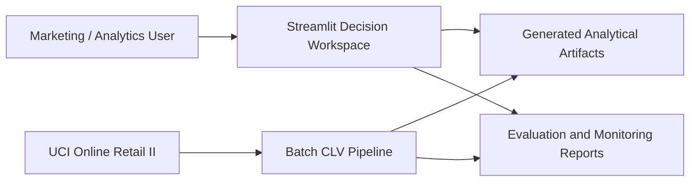
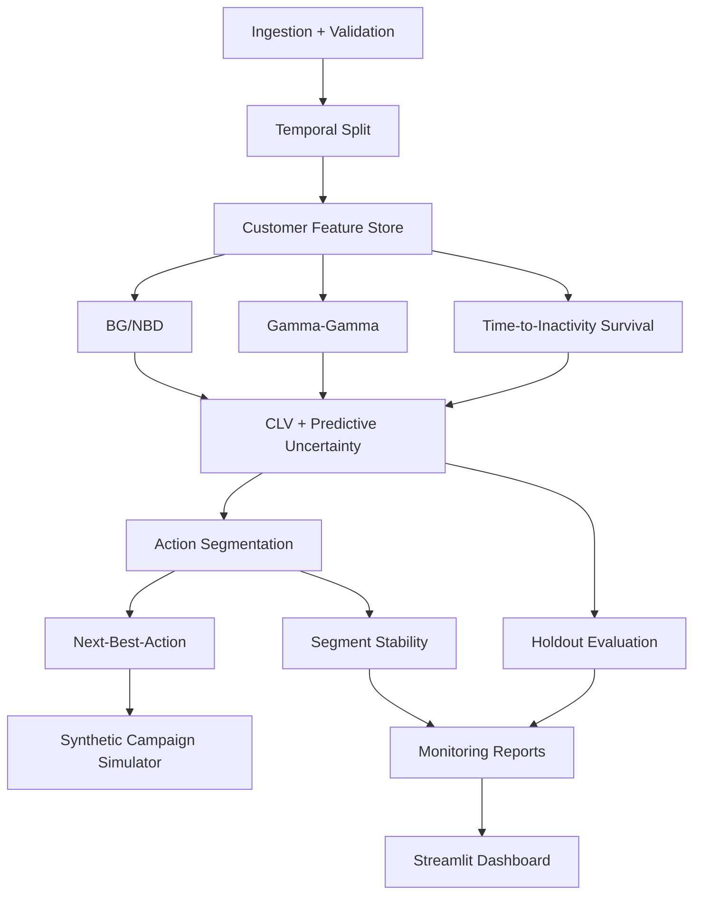
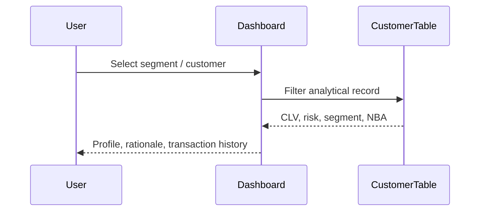

# Solution Design Pack — BDS-34

## Architecture decision

The capstone uses a batch analytical pipeline with a Streamlit application interface. A REST API is **out of scope** for the submitted implementation; the decision is explicit rather than implied by documentation.

## C4-style context

## Container design

## Data contracts

The main analytical contract is the customer table in `data/processed/customer_clv_segments.parquet`. Key fields include:

- `customer_id`: analytical customer identifier.
- `frequency`, `recency_days`, `customer_tenure_days`: BG/NBD behavioural inputs.
- `monetary_value`: repeat-order monetary input for Gamma-Gamma.
- `p_alive`: model-estimated probability of being active.
- `inactivity_prob_30d`, `inactivity_prob_60d`, `inactivity_prob_90d`: survival-derived risk measures.
- `clv_expected_30d`, `clv_expected_90d`, `clv_expected_180d`, `clv_expected_365d`: expected discounted value.
- `clv_lower_80pct`, `clv_upper_80pct`: 80% Monte Carlo predictive interval for the configured default horizon.
- `action_segment`: deterministic action segment.
- `nba_recommended_action`, `nba_channel`, `nba_estimated_cost`, `nba_expected_incremental_value`: prescriptive decision fields.

## Sequence: customer decision

## Test strategy

- Unit tests: feature, cohort, probabilistic models, CLV, segmentation, NBA, validation.
- Integration test: end-to-end pipeline contract.
- Static validation: Python compilation.
- Security: Bandit and pip-audit in CI.
- Performance evidence: `scripts/performance_check.py`.
- Evaluation: temporal holdout, baseline comparison, uncertainty coverage, calibration, sparse-history sensitivity, and segment transitions.

## Security decision

The capstone is an analytical prototype, not an authenticated production application. The dashboard does not claim production RBAC. Deployment hardening, authentication, authorization, secrets management, rate limiting, and audit logging are production follow-up work.
